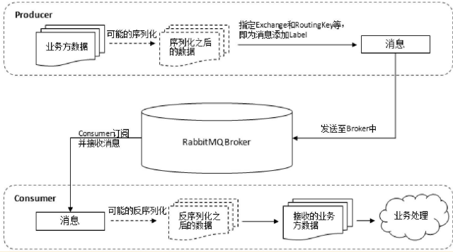
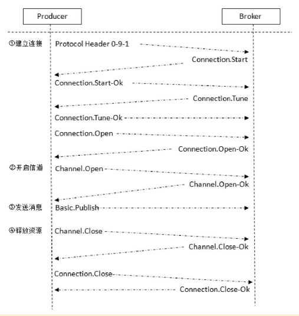
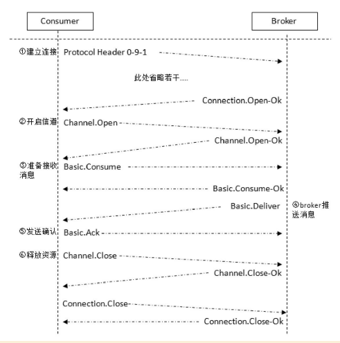
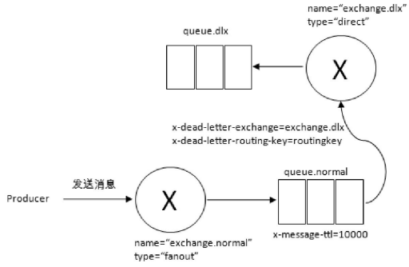
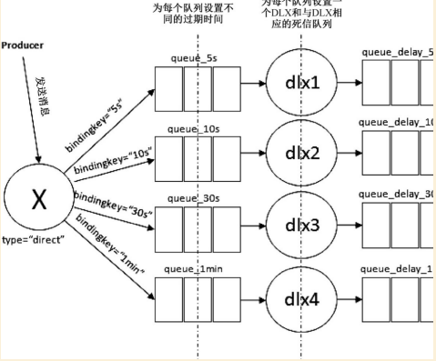

# mq-compent

## 项目介绍
### 目的
封装rabbitmq，降低消息发送和消费业务代码量
### 调试方法：
启动MqClientApplication，执行MqSendDemoTest即可查看消息的发送及消费（启动和发送没有先后顺序）

## RabbitMQ
### 常用指令
* 启动：rabbitmqctl -server -detached
* 查看是否启动成功： rabbitmqctl status
* 查看集群信息：rabbitmqctl cluster_status
* 创建用户：rabbitmqctl add_user username psd
* 设置用户所有权限：rabbitmqctl set_permissions -p/username ". *" ". *" ". *"   
* 设置用户权限：rabbitmqctl [--node <node>] [--longnames] [--quiet] set_permissions [--vhost <vhost>] <username> <conf> <write> <read>
* *命令帮助：rabbitmqctl help
### 消息队列远转过程

* RoutingKey：路由键，生产者将消息发送给交换机的时候，一般会指定一个路由键，用来指定这个消息的路由规则，而RoutingKey需要与交换机类型、BindingKey联合使用才能最终生效。
* Binding：绑定。RabbitMQ中通过绑定将交换机与队列关联起来，在绑定时一般会指定一个绑定键（BindingKey）
* 交换机类型： 
1. direct：RoutingKey与Binding需要完全匹配；
2. topic：RoutingKey与Binding需要模糊匹配;*：匹配一个单词，#用友匹配多规格单词
3. fanout：把所有发送到该交换机的消息路由到所有与该交换机绑定的队列中
4. headers

* 备份交换机
1. 如果设置的备份交换机不存在，客户端和RabbitMQ服务端都不会有异常，此时消息会丢失。
2. 如果备份交换机没有绑定任何队列，客户端和RabbitMQ服务端都不会有异常，此时消息会丢失。
3. 如果备份交换机没有任何匹配的队列，客户端和RabbitMQ服务端都不会有异常，此时消息会丢失。
4. 如果本分交换机和mandatory参数一起使用，mandatory参数无效。
5. 实际应用中建议使用TTL和DLX代替immediate参数。
### 过期时间TTL
* 设置消息方式：
1. 队列属性设置，所有消息有相同的过期时间；channel.queueDeclare加入x-message-ttl参数，单位毫秒
2. 消息本身单独设置，每个消息有自己的过期时间；
3. 同时设置时，取最小的作为过期时间；
4. 消息在队列中生存时间超过TTL，会变成“死信”（Dead Message）
* 如果采用设置队列属性的方法设置TTL,过期的消息会从队列中抹掉。因为过期队列一定在队列头
* 如果消息本身单独设置的话，不会马上抹掉，而是在消费即将投递到消费者之前判断。因为如果要抹掉的话需要遍历整个队列
* 设置队列的TTL：channel.queueDeclare加入x-expires参数
* 死信交换机DLX

### 延迟队列
RabbitMQ本身没有直接支持延迟队列，但是可以通过TTL和DLX模拟延迟队列功能

### 优先级队列
可以通过设置队列的x-max-priority参数来设置优先级
### RPC